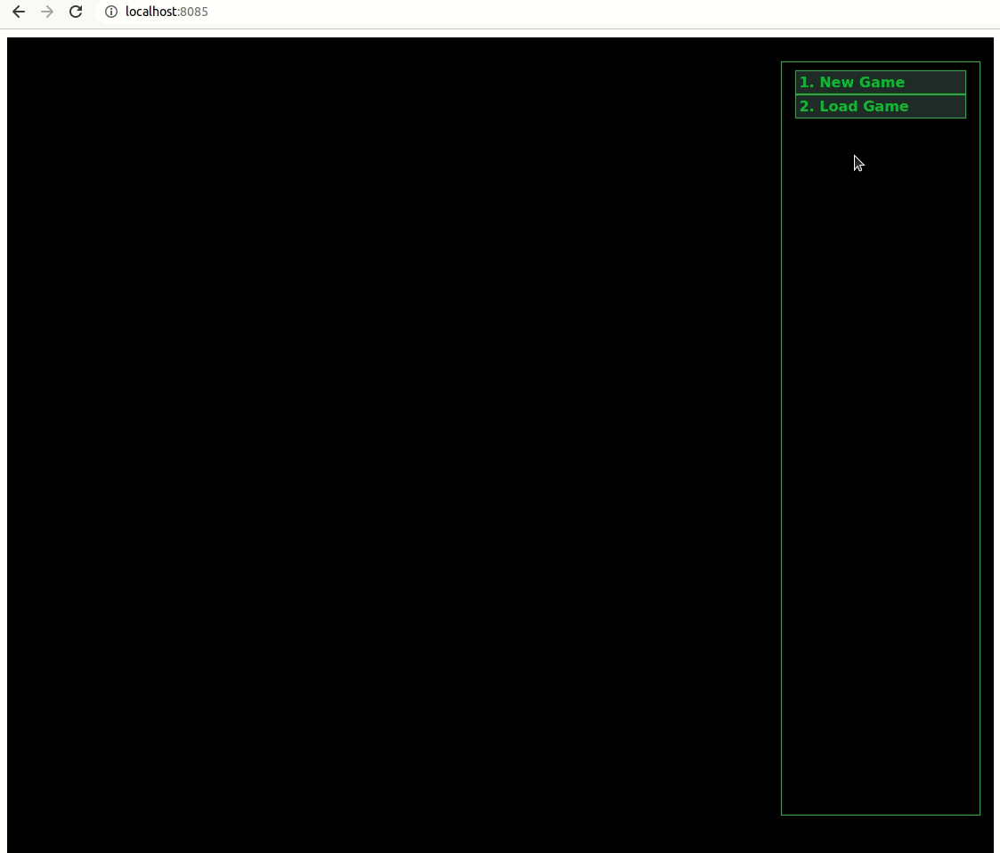
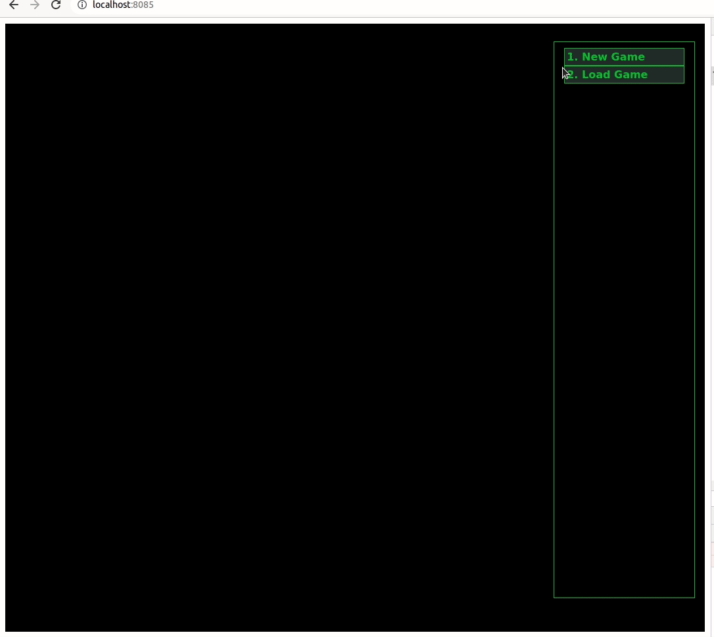

Description
===========

**Dungeon of Fears** is POC (proof-of-concept) game for HaG framework - Yarn Spinner based scripts with some extra (unfortunately incompatible with official YS) flavor. Scripts are transpiled into C++ code and binaries produced, which represent server-side web game.

Turn based movement and battles with some events as visual novel are planned.

Win Condition
=============

Top
===

Trading
=======

Underground
===========

Movement
========

Resources
=========

Loot
====

Events
======

Battle
======

Latest Screenshots
==================

If you want to know more, subscribe to HaG framework telegram channel https://t.me/haggamedev, where I will publish some news and updates regarding HaG framework itself and projects on top of it.

Credits
=======

* Dungeon tiles https://rgsdev.itch.io/free-isometric-dungeon-game-tileset-2d-asset-by-rgsdev (RGS_Dev)
* Character and NPC tiles https://opengameart.org/content/isometric-dungeon-tileset (Dragosha)
* Icons https://game-icons.net/
    + Hearts icon by Skoll under CC BY 3.0
    + Human ear icon by Delapouite under CC BY 3.0
    + Eyeball icon by Lorc under CC BY 3.0
    + Hooded figure icon by DarkZaitzev under CC BY 3.0
    + Wingfoot icon by Lorc under CC BY 3.0
    + Biceps icon by Delapouite under CC BY 3.0
    + Bordered shield icon by Lorc under CC BY 3.0
    + Swap bag icon by Lorc under CC BY 3.0
    + Gem pendant icon by Lorc under CC BY 3.0
    + Spartan helmet icon by Delapouite under CC BY 3.0
    + Power ring icon by Delapouite under CC BY 3.0
    + Gloves icon by Delapouite under CC BY 3.0
    + Lamellar icon by Lorc under CC BY 3.0
    + Knapsack icon by Lorc under CC BY 3.0
    + Boots icon by Lorc under CC BY 3.0
