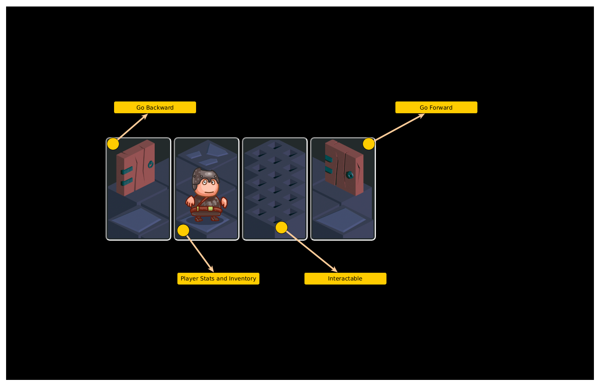

Description
===========

**Dungeon of Fears** is POC (proof-of-concept) game for HaG framework - Yarn Spinner based scripts with some extra (unfortunately incompatible with official YS) flavor. Scripts are transpiled into C++ code and binaries produced, which represent server-side web game.

Turn based movement and battles with some events as visual novel are planned.

Win Condition
=============

Endless

Loose Condition
===============

It is not rogue like, you will not die. In the future some penalties may apply.

Save/Load
=========

Save and load options available. Save is working on dungeon entrance only for now.

Top
===

Trading
=======

Underground
===========

Navigation
==========

Each corridor leads to a room:

Each room leads to a corridor:

Observe
=======

Objects observing relies on **Perception** and **Listen** sense stats. The higher are they, the more objects you can find in the rooms or discover objects stats.

Unlock and Disarm
=================

You may encounter traps, locked doors or chests. **Listen** stat is used for automatic unlock or disarm. When object is too complex - "find pair" mini game is started, when you will find enough of pairs, unlock/disarm will succeed.

.. image:: doc/event-tutorial/HaG-door-unlock-minigame.png
   :align: center
   :height: 400
   :width:  600

Resources
=========

Loot
====

Events
======

For now only tutorial event is added.

Battle
======

Latest Gameplay
===============

+---------------------------------------+---------------------------------------+
| .. image:: doc/HaG-Dungeon-211014.gif | .. image:: doc/HaG-Dungeon-211112.gif |
|    :align: center                     |    :align: center                     |
|    :height: 100                       |    :height: 100                       |
|    :width:  100                       |    :width:  100                       |
+---------------------------------------+---------------------------------------+

+ Languages support (en, uk)
+ Player character generation
+ Save / Load game (save files you should store on your computer/phone)
+ Small tutorial events
+ Rooms and Corridors generation
+ Character inventory (empty for now)
+ Chests with coins to loot
+ Traps
+ Locked chests and doors
+ Unlock/disarm mini game

.. image:: doc/HaG-Dungeon-211202.gif
   :align: center
   :height: 400
   :width:  600

If you want to know more, subscribe to HaG framework telegram channel https://t.me/haggamedev, where I will publish some news and updates regarding HaG framework itself and projects on top of it.

Playtest
========

From now on you can play test it on http://hag.pp.ua

It is both desktop and mobile friendly (portrait mode recommended).

Credits
=======

* Dungeon tiles https://rgsdev.itch.io/free-isometric-dungeon-game-tileset-2d-asset-by-rgsdev (RGS_Dev)
* Character and NPC tiles https://opengameart.org/content/isometric-dungeon-tileset (Dragosha)
* Icons https://game-icons.net/
    + Hearts icon by Skoll under CC BY 3.0
    + Human ear icon by Delapouite under CC BY 3.0
    + Eyeball icon by Lorc under CC BY 3.0
    + Hooded figure icon by DarkZaitzev under CC BY 3.0
    + Wingfoot icon by Lorc under CC BY 3.0
    + Biceps icon by Delapouite under CC BY 3.0
    + Bordered shield icon by Lorc under CC BY 3.0
    + Swap bag icon by Lorc under CC BY 3.0
    + Gem pendant icon by Lorc under CC BY 3.0
    + Spartan helmet icon by Delapouite under CC BY 3.0
    + Power ring icon by Delapouite under CC BY 3.0
    + Gloves icon by Delapouite under CC BY 3.0
    + Lamellar icon by Lorc under CC BY 3.0
    + Knapsack icon by Lorc under CC BY 3.0
    + Boots icon by Lorc under CC BY 3.0
